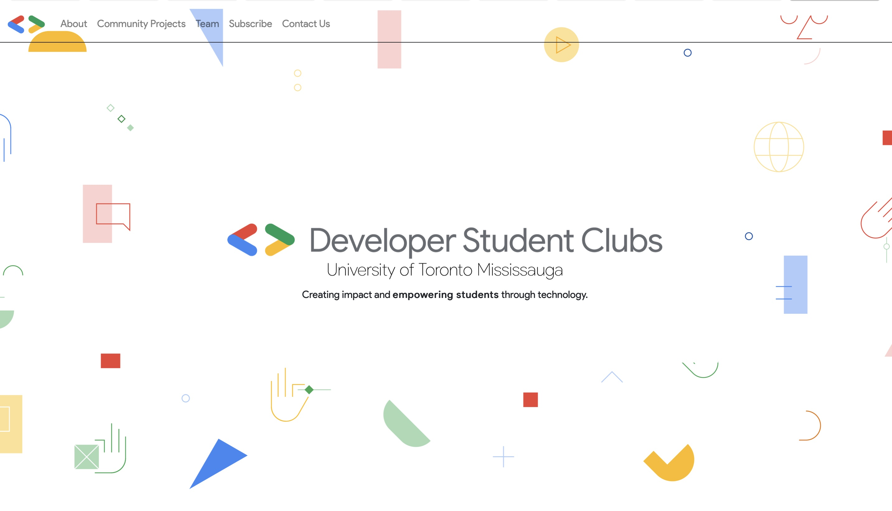

<div id="top"></div>

<br />
<div align="center">
  <p align="center" style="font-size:4em;">GDSC Website</p>
  
  <p align="center">
    <div>Put Description Here</div>
    <br />
    <a href="https://github.com/UTSCCSCC01/finalprojectw22-gdscutm/issues">Report Bug</a>
    ·
    <a href="https://github.com/UTSCCSCC01/finalprojectw22-gdscutm/issues">Request Feature</a>
    <br/>
    <br/>
    <div>This project is still <strong>In Progress</strong> and <strong>Not Deployed</strong>.</div>
  </p>
  <hr>
</div>

<details open style="padding-top: 5vh;padding-bottom:5vh;">
  <summary>Table of Contents</summary>
  <ol>
    <li>
      <a href="#about-the-project">About The Project</a>
      <ul>
        <li><a href="#motivation">Motivation</a></li>
      </ul>
    </li>
    <li>
      <a href="#getting-started">Getting Started</a>
      <ul>
        <li><a href="#prerequisites">Prerequisites</a></li>
        <li><a href="#installation">Installation</a></li>
        <li><a href="#buit-with">Built With</a></li>
      </ul>
    </li>
    <li><a href="#contribution">Contribution</a></li>
    <li><a href="#contact">Contact</a></li>
    <li><a href="#acknowledgements">Acknowledgements</a></li>
  </ol>
</details>

#### Sprint Shortcut

<ul style="display:flex;padding-bottom:5vh">
    <li style="flex-grow:1"><a href="">sprint0</a></li>
    <li style="flex-grow:1"><a href="">sprint1</a></li>
    <li style="flex-grow:1"><a href="">sprint2</a></li>
    <li style="flex-grow:1"><a href="">sprint3</a></li>
    <li style="flex-grow:1"><a href="">sprint4</a></li>
</ul>
<hr>

## About The Project

Short description about this project

### Motivation

Why are we doing this project? Who will be beneficial from this project? 

<p align="right">(<a href="#top">back to top</a>)</p>

## Getting Started

### Prerequisites

While this product is still in production, these following steps are recommanded to be done in a virtual environment
* npm
  ```sh
  npm install npm@latest -g
  ```

### Installation

To be added during sprint 1

### Built With

A list of frameworks

<p align="right">(<a href="#top">back to top</a>)</p>

## Contribution

Do you use git flow?

What do you name your branches?

Do you use github issues or another ticketing website?

Do you use pull requests?
<p align="right">(<a href="#top">back to top</a>)</p>

## Contact

<p align="right">(<a href="#top">back to top</a>)</p>

## Reference

<p align="right">(<a href="#top">back to top</a>)</p>

<hr>

###### All rights reserved to UTM CSC301 course
